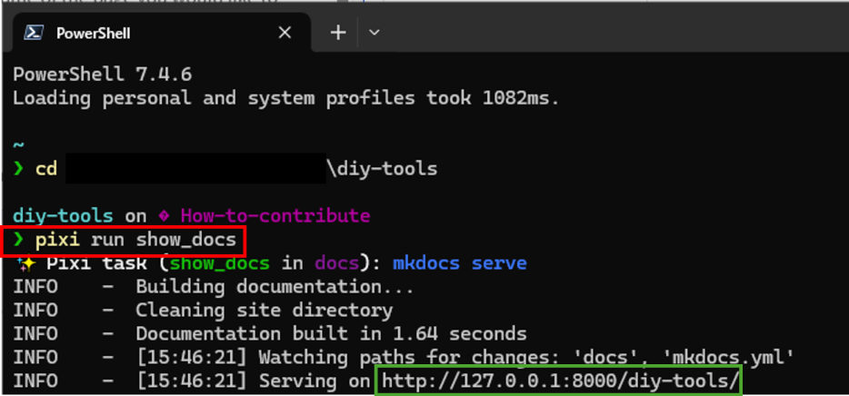
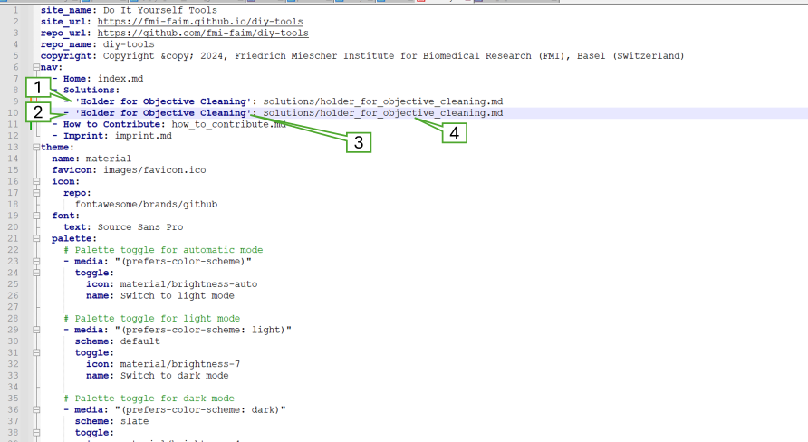
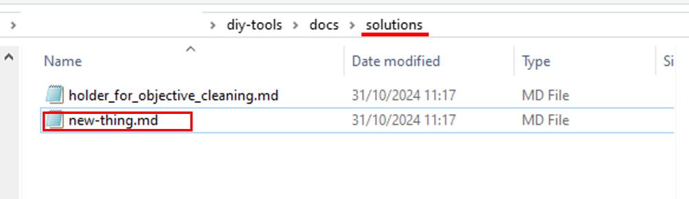

# How to add new "Solutions" to this page

## General
- Clone the repository or fetch from the main branch to ensure your repository is up to date
- Create a new branch with the name of the page you would like to add

## Preparation
- Open the `mkdocs.yml` file with Notepad++ or another text editor (`diy-tools` repository folder)
- Open a terminal window and navigate to your `diy-tools` repository
	- Make sure you are using your newly created branch
- Type
		"pixi run show_docs" (red box)

- Copy the IP address (see green box) into your webbrowser
	- When ever you **save** a change in your file, the changes will be rendered in the browser window

## Adding a new solution

In your mkdocs.yml (opened in section "Preparation")

1. Copy the last line in section "Solution" (e.g. shown in screen shot)
2. Paste the line below
3. Change the name to the new tool you would like to add
4. Change the name of the md file accordingly

!!! warning "Don't forget to create a new md file describing your "new thing" in the solutions subfolder of the docs folder in the repository"
	
