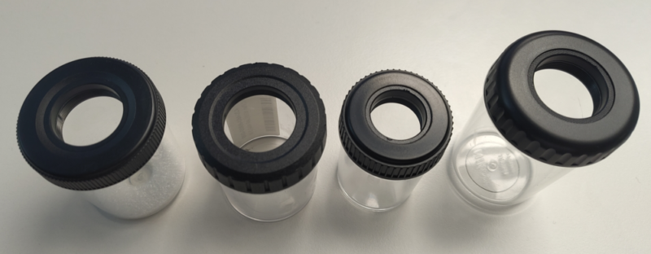
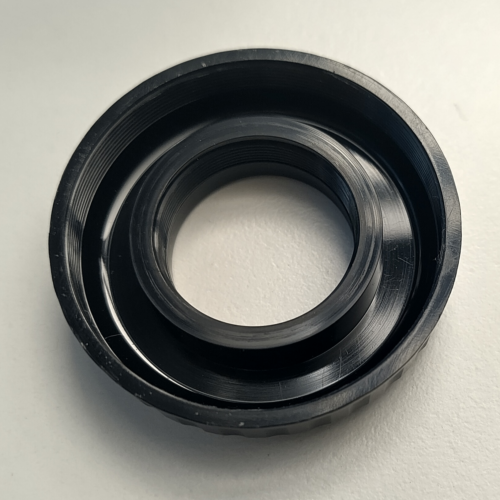
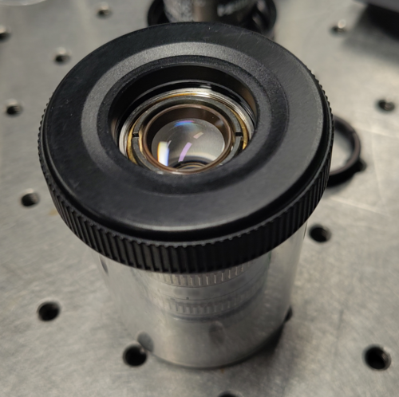

# Holder for Objective Cleaning

Clean objectives are essential to acquire scientific data. To facilitate the cleaning, the objective lenses should be easy to access, whilst ensuring the objective remains stable and protected. For this purpose, we modified objective boxes to make the cleaning of both the front and back lenses of objectives possible. Do not use these holders for objective storage as the objectives would not be protected from dust!!

Holders for each objective manufacturer.

### Description
A hole was made in the cap of objective boxes making sure the thread for screwing the objective in the cap remained intact.

Objectives can be screwed into the cap to clean the front lens of the objective as usual. With the barrel of the boxes screwed in, the back lens of the objective becomes safely accessible for cleaning.

### How was it done

The black cap was held in a 3 jaw chuck on a lathe and a Ø12mm hole was drilled through the cap. Ø12mm is the largest drill bit that could be easily held in the drill chuck, but it can be any size that is smaller than the desired hole diameter.

Once the hole was drilled, an internal turning bar was used to turn the hole diameter to the wanted size.

Be careful with drilling in plastic parts with large diameter tools. It is recommended to enlarge the holes gradually to prevent breakage.

### Acknowledgement

The work was carried out by the mechanical workshop of the FMI.
